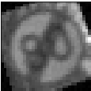
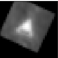

# **Traffic Sign Recognition** 

---

**Build a Traffic Sign Recognition Project**

The goals / steps of this project are the following:
* Load the data set (see below for links to the project data set)
* Explore, summarize and visualize the data set
* Design, train and test a model architecture
* Use the model to make predictions on new images
* Analyze the softmax probabilities of the new images
* Summarize the results with a written report

---


### Data Set Summary & Exploration

#### 1. Basic summary of the data.

The code for this step is contained in the code cell #4 of the IPython notebook.

I used the pandas/numpy libraries to calculate summary statistics of the traffic signs data set:

* The size of training set is 34799
* The size of test set is 12630
* The shape of a traffic sign image is (32, 32, 3)
* The number of unique classes/labels in the data set is 43

#### 2. Exploratory visualization of the dataset.

The code for this step is contained in code cells #5, #6, #7 and #8 of the IPython notebook.

The code cell #6 contains the list of all categories with 5 randomly selected images for each category.

The code cell #8 contains 2 bar charts (for train and valid datasets) showing how many samples presented for each category,
so using these 2 charts we can see that both datasets are not balanced.


![Train Dataset Distribution][report/balance-chart-train.png]

---

### Design and Test a Model Architecture

#### 1. PreProcessing the image data.

The code for this step is contained in the code cell #12, #13, #14

The PreProcessing is splitted into 2 main steps:
* BasePreProcessing
* StatsPreProcessing

**BasePreProcessing** has the following steps:
* converting [0-255] range to [0-1] - for 
* RGB -> GRAY
* HistogramEqualization

**StatsPreProcessing**
After BasePreProcessing I compute MEAN and STDDEV of TEST Datasets, and then using MEAN and STDDEV I make StatsPreProcessing:
* zero-centering (subtracting the MEAN)
* normalization (dividing by STDDEV)

Converting RGB image to Grayscale is made because for classifying traffic signs Grayscale image is sufficient,
and Grayscale image requires less resources (memory/CPU/GPU) by NNs.

HistogramEqualization allowed me to improve Accuracy of the final NN (about 1-1.5%).

Zero-centering and normalization speed up training process.

#### 2. Set up training, validation and testing data.

As I mentioned above the Origin Dataset was not balanced. 

To partially balance Test/Valid datasets I implemented method *augment_data* (see in file [AugmentData.py](AugmentData.py) ).

The method augments dataset by randomly selected transformations (make_noisy_image, zoom_out_image, zoom_in_image, rotate_image, shift_image, shear_image).

I augmented the Origin Dataset in a way that each category should have at least 1000 samples.

Using Augment Dataset allows to build more robust NN, cause such NN trains on more data and data have different transformations.

The structure of the Dataset:

| Dataset         	|     # of Samples in Origin Dataset   		| # of Sample in Augment Dataset |
|---------------------- |-----------------------------------------------|--------------------------------| 
| Train         	| 34799						| 51690				 |
| Valid			| 4410						| 5630				 |
| Test			| 12630						| -				 |

Number of samples by categories for the Augment Dataset is presented at below charts:


The examples of augmented images:

| Transformation type	  | Result Image 					|
|:-----------------------:|:---------------------------------------------------:|
| Rotation	  	  | 		|
| Rotation and Zoom-out	  | 	|
| Shearing	  	  | 		|
| Shearing and Zoom-out	  | 	|
| Zoom-in	  	  | 		|
| Zoom-out	  	  | 		|


Also I implemented Keras like ImageDataGenerator for generating the Augment Dataset on the fly 
(see AugmentDataGenerator and BalancedAugmentDataGenerator in [AugmentData.py](AugmentData.py)),

it works, but requires more execution time at training process, so I decided to prepare the Augment Dataset at once, store it on disk and reuse it.


#### 3. Final model architecture

Finding a good model requires trying many different architectures.

To facilitate this process I have created class LeNet in the file [LeNet.py](LeNet.py) which allows 
to create, configure, train, save, restore, evaluate accuracies, etc. model described by LeNetConfig class (is placed in the same [LeNet.py](LeNet.py) file too)

This approach saved my a lot of time, cause for changing model I needed just point in my config dictionary a new model's settings.

For example my Final model is described in the code (cell #22) as:
```python
final_params = {
            'conv': [{'num_filters': 16, 'filter_size': 3, 'pool_size': 0, },
                     {'num_filters': 16, 'filter_size': 3, },
                     {'num_filters': 64, 'filter_size': 3, 'pool_size': 0},
                     {'num_filters': 64, 'filter_size': 3, }
                    ],
            'fc': [256, 256],
            'lr_start': 1e-3, 
            'l2': 1e-3, 
            'dropout_prob': 0.25, 
            'batch_size': 64
}
```

So it means, that the Final model consisted of the following layers:

| Layer         		|     Description	        					| 
|:-----------------------------:|:---------------------------------------------------------------------:| 
| Input         		| 32x32x1 Gray image   							| 
| Convolution 3x3    	 	| 1x1 stride, no padding, outputs 30x30x16 				|
| RELU				|									|
| Convolution 3x3		| 1x1 stride, no padding, outputs 28x28x16				|
| RELU				|									|
| Max pooling	      		| 2x2 stride,  outputs 14x14x16		 				|
| Convolution 3x3	    	| 1x1 stride, no padding, outputs 12x12x64				|
| RELU				|									|
| Convolution 3x3		| 1x1 stride, no padding, outputs 10x10x64				|
| RELU				|									|
| Max pooling	      		| 2x2 stride,  outputs 5x5x64		 				|
| Fully connected		| 256 hidden units							|
| RELU				|									|
| Fully connected		| 256 hidden units							|
| RELU				|									|
| Fully connected		| 43 hidden units							|
| Softmax			|      									|
 

#### 4. Training the model

The code for training the model is located in the class LeNetSolver (the file [LeNet.py](LeNet.py))

To train the model, I used:
* AdamOptimizer is used
* batch size is selected equal to 64 to fit into a memory (for example 128 is not fit for the Final Model into my GPU memory).
* number of epochs is equal to 100 
* learning rate is equal to 1e-3
* L2 regularization is equal to 1e-3
* Dropout value is equalt to 0.25


#### 5. The approach taken for finding a solution. 
I started from LeNet-5 architecture described in the lection.

It gave valid_accuracy about 91%.

To find good values for hyperparameters I implemented RandomSearch (see file [RandomSearch.py](RandomSearch.py))

It's the simple implementation of ideas described [here](http://www.jmlr.org/papers/volume13/bergstra12a/bergstra12a.pdf)

Due to changes made in the my NN API, currently RandomSearch does not work.

But earlier it allowed to get some info about what values of hyperparameters give better validation accuracy.

For example after that I used L2 regularization = 1e-3 and dropout = 0.5 - it increased valid_accuracy up to 93%.

Also RandomSearch allowed to notice that good value for number of hidden units of FullyConnected Layers is 256.

Then I decided to work on Convolutional Layers.

The first result improvement was noticed when I added additional ConvLayer(+RELU+MAX_POOL).

The next improvements was achieved by:
* introducing the Augment Dataset.
* HistogramEqualization
* Decreasing FilterSize from 5x5 to 3x3
* Adding yet one ConvLayer

The code for calculating the accuracy of the model is located in the class *LeNet* method *eval_accuracy*.

My final model results were (see cells #47, #48, #49):
* training set accuracy of 99.6%
* validation set accuracy of 98.5% 
* test set accuracy of 98.1%

--- 

### Test a Model on New Images

#### 1. Choosing 12 German traffic signs found on the web.

I have found 12 German traffic signs on the web, 4 of them might be difficult to classify because of noises on them (leafes, snow):
* 
* 
* 
* 

For other images my Model should give good results.

#### 2. The model's predictions on these new traffic signs and compare the results to predicting on the test set. 
The code for making predictions on my final model is located in the cell #26 of the Ipython notebook.

Here are the results of the prediction:


Real Classes:	    [ 1 12 13 15 17 25 31 33 36  **2** 14 **25**]

Predicted Classes:  [ 1 12 13 15 17 25 31 33 36  **4** 14 **22**]

The model was able to correctly guess 10 of the 12 traffic signs, which gives an accuracy of 83.3%. 

As I expected 2 noisy images are predicted incorrectly:
*  - predicted as Speed Limit 70
*  - predicted as Bumpy Road.

For both cases we see that predicted signs are very similar to origin ones:
* 
* 


#### 3. How certain the model is when predicting on each of the five new images by looking at the softmax probabilities for each prediction

Softmax probabilities were output in the cell #44. 

We can see barchart which shows predicted probabilities for web images:


We see that for all images, except 2 wrong predicted images, the probability of first prediction is almost 1.0.


Let's see the probabilities for wrong cases:

For the Speed Limit 50, the model is relatively sure that this is a Speed Limit 70 sign (probability of 0.883). 

The probability for Speed Limit 50 is just 0.029.

The top five soft max probabilities were

| Probability         	|     Prediction	        		| 
|:---------------------:|:---------------------------------------------:| 
| .883         		| Speed Limit 70 				| 
| .029     		| Speed Limit 50				|
| .021			| Speed Limit 30				|
| .021	      		| Speed Limit 20 				|
| .009			| Dangerous curve to the left			|


For the Road Work, the model is almost absolutely sure that it is Bump Road sign is 0.999987960.

The probability for Road Work is only 6.75739830e-06.
